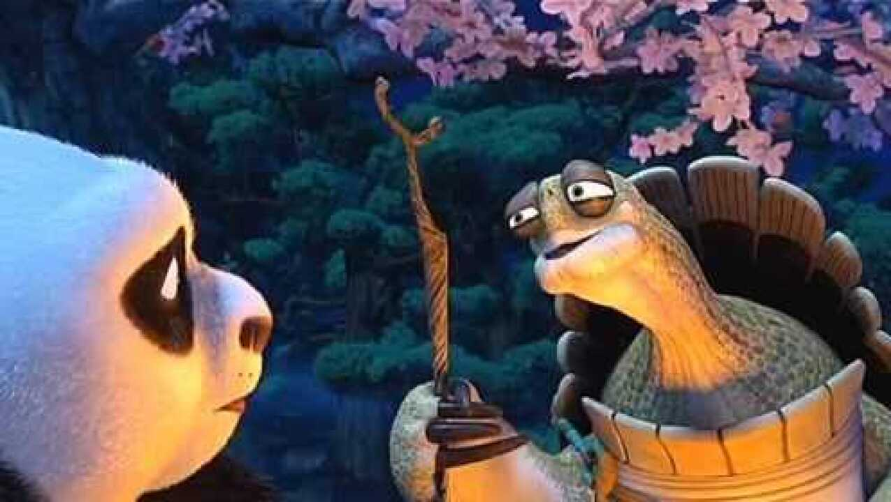

> 你患得患失，太在意从前，又担心将来，有句话说的好“昨天是段历史，明天是个谜团，而今天是天赐的礼物，像珍惜礼物那样珍惜今天！”。

 乌龟大师宛若哲人般的教诲让人豁然开朗，人生充满选择，选择的背后会有不同的路径，没有绝对的好坏，落字则安，高手从不举棋不定。没有哪一种人生是绝对
完美的，生来总有缺憾，你所要做的乃是忘记背后、努力面前，寻找新的自我。
### 焦虑源自不确定性
 焦虑的本质源自于巨大的不确定性，当人无法看清未来时，会在迷茫、无助中焦虑不已，你需要的勇往直前，既不盲目自信、也不妄自菲薄。
 纵使万般艰难，你当始终坚信万家灯火总有一盏为你停留，同理，万般工作，也总有一个会在未来不期而遇。当自己看不清未来的时候，就去做确定的事，
 运动健身、阅读经典、技能提升，用确定性的蓄力积累去对抗不确定性的虚无。
### 勇敢去做是对抗不确定性的良药
 当你有万千想法时，想的越多，路径越复杂，思绪越混乱，正如曾经有年轻人请教杨绛先生为何能够处事不惊坦然生活，她的回复是：“你的问题就是书读的太少，想的太少。”
努力让自己静下心来，去做有益的事情，停止对未来不确定性的恐慌与茫然。深处格局巨变的当下，“没有稳定的事、只有稳定的人”。保持自我精进、情绪稳定，调整节奏， 静候花开。
### 停止灾难性的自我演绎
 或好或坏，你所思虑的80%都不会发生，停止灾难性的自我演绎，活在当下，享受当下。just do it！
